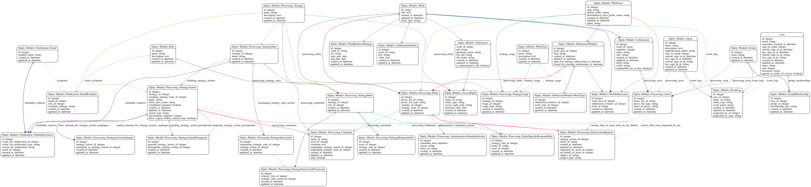

# Sipity

[](https://travis-ci.org/ndlib/sipity)
[](https://codeclimate.com/github/ndlib/sipity)
[](https://codeclimate.com/github/ndlib/sipity)
[](https://gemnasium.com/ndlib/sipity)
[](http://inch-ci.org/github/ndlib/sipity)
[](./LICENSE)
[](./CONTRIBUTING.md)

Sipity is a patron-oriented deposit interface into CurateND.
Its goal is to provide clarity on why a patron would want to fill out metadata information.

* Does the patron want a DOI? Ask them to provide a publisher and publication date.
* Does the patron want to include the works citation? Encourage them to fill out the component fields for building a citation, or have them provide the citation.
* Does the patron want their deposit to be listed in Google Scholar? Fill out this information.
* Does the patron want other people to assist them on editing this information? Fill out this particular information.

## Getting Your Bearings

Sipity is a Rails application but is built with a few more concepts in mind.


1. A request comes into the Router.
2. Router maps request to a Controller.
3. Controller maps request to a Runner.
4. Runner enforces Authentication layer
5. Runner enforces Authorization layer
6. Runner processes request by collaborating with the Repository and Job.
7. Runner generates response for the Controller.
8. Controller passes response through Decoration layer.
9. Controller generates response for Responder.
10. Responder sends response to the request.

### RSpec output

Don't forget, you can run `rspec --format documentation` (or its equivalent `rspec -f d`) to run the tests and output a "self-documentation" format.
I am doing my best to re-read the output tests to make sure they are adequate/accurate low-level documentation.

## Anatomy of Sipity

Below is a list of the various concepts of Sipity.

```
app
|-- assets
|-- controllers
|-- conversions
|-- decorators
|-- exceptions
|-- forms
|-- jobs
|-- helpers
|-- mailers
|-- models
|-- policies
|-- repositories
|-- runners
|-- services
|-- validators
|-- views
```

### Cohesion, Orthogonality, and Decoupling

I am working to keep the various concepts of Sipity loosely coupled.
I use the various `rake spec:<layer>:coverage` tasks to help me understand how each layer's specs cover that layer's code.

My conjecture is that if each layer's specs cover the entire layer:

* I have a well documented internal API.
* My feature tests can focus on integration of the various layers.

### Assets, Controllers, Helpers, Mailers, Models, Views

The usual Rails suspects.

Jeremy's Admonition:

* **Though shalt not put behavior in ActiveRecord objects**
  - This means:
    * No before/after save callbacks - prefer repository service/command objects/methods
    * No query scopes - prefer repository query objects/methods
    * No conditional validations - prefer form objects
  - Why?
    * Because the data structures are important, but "creating the universe" everytime you want to deal with a persisted object is insanity.
* **Though shalt not use ActionController filters**
  - This means:
    * Pushing authentication to another layer
    * Pushing authorization to another layer
    * Pushing cache management to another layer
    * Avoid before/after filters
  - Why?
    * Because controllers have enough stuff going on; They are often hard to test.
      - Ensuring you have the correct parameters
      - Mapping the results of the action to a response
      - Communicating any messages
      - In other words, they already have enough reasons to change.
* **Though shalt think about command line interaction**
  - This means:
    * The controllers are one of many possible clients for the underlying application.
  - Why?
    * Because if you can disentangle your application from the web pages, you will have a richer application.

### Conversions

Taking a cue from [Avdi Grimm's "Confident Ruby"](http://www.confidentruby.com/), Conversions are responsible for coercing the input to another format. These are similar to `Array()` function.

The Conversions modules are designed to be either:

* callable via module functions
* include-able and thus expose an underlying conversion method

Find out more about [Sipity's Conversions](https://github.com/ndlib/sipity/blob/master/app/conversions/sipity/conversions.rb)

### Decorators

Models are great for holding data.
Decorators are useful for collecting that data into meaningful information.

Take a look at the [Draper gem](https://github.com/drapergem/draper). It does a
great job of explaining their importance.

Find out more about [Sipity's Decorators](https://github.com/ndlib/sipity/blob/master/app/decorators/sipity/decorators.rb)

### Forms

Forms are a class of objects that are different from models. They may represent
a subset of a single model's attributes, or be a composition of multiple
objects.

Regardless their purpose is to:

* Expose attributes
* Validate attributes

They are things that could be rendered via the `simple_form_for` view template
method.

As of the writing of this, I'm not making use of Nick Sutterer's fantastic
Reform gem. Though it could make its way into this application.

Find out more about [Sipity's Forms](https://github.com/ndlib/sipity/blob/master/app/forms/sipity/forms.rb)

### Jobs

There are certain things you don't want to do during the HTTP request cycle.
Expensive calculations, remote service calls, etc.

Find out more about [Sipity's Jobs](https://github.com/ndlib/sipity/blob/master/app/jobs/sipity/jobs.rb)

**Note: With the imminent arrival of the ActiveJob into Rails 4.2, this subsystem may undergo a change.**

### Policies

Take a look at the [Pundit gem](https://github.com/elabs/pundit). Sipity is
implementing policies that adhere to the interface of Pundit Policy and Scope
objects.

Find out more about [Sipity's Policies](https://github.com/ndlib/sipity/blob/master/app/policies/sipity/policies.rb)

### Repositories

Of particular note is the Sipity::Repository class. Here are methods for
interacting with the persistence layer; either by way of commands or queries.

Find out more about [Sipity's Repositories](https://github.com/ndlib/sipity/blob/master/app/repositories/sipity/repository.rb)

### Runners

This is a step towards crafting a single class per Controller action.
They are an implementation idea of the late Jim Weirich and provide a fantastic
means of pulling even more logic out of the overworked Rails controller.

Find out more about [Sipity's Runners](https://github.com/ndlib/sipity/blob/master/app/runners/sipity/runners.rb)

### Services

The grand dumping ground of classes that do a bit more than conversions and
may not be a direct interaction with the repository.

Find out more about [Sipity's Services](https://github.com/ndlib/sipity/blob/master/app/services/sipity/services.rb)

### Validators

Because we have a need for custom validation.

### Models

For completeness, including a rudimentary Entity Relationship Diagram (ERD).



## Relationship Between Forms, Models, and Decorators

* A decorator exposes a _logical group_ attributes that a user can see.
* A form exposes a _logical group_ of attributes for a user to edit.
* A model persists attributes in a _normalized_ manner.

A decorator's attributes may be queried from numerous models.

A form's attributes may end up persisted across numerous models.
The initial value for any of those attributes may be retrieved from persisted models.

Multiple forms may exist that modify the same underlying attribute.

For example, we ask our patrons to provide a title when they create a work.
If the patron then assigns DOI, there is a form that exposes the same title along with other attributes (i.e. publisher).
If the patron then assigns a citation, and filled out a DOI, we'll leverage the same publisher as reported.

The fundamental idea is that we are providing different contexts for our patrons to fill out information.
And each metadatum may be shared across different contexts.

The idea is stretched further, as we consider something like an geo-spatial data.

If one context is "Tell us about your geo-spatial data" then that data will be required.
If you don't want to fill it out, cancel what you are doing.

If another context is "Tell us about your metadata" and we expose geo-spatial data, then that data would not be required.

